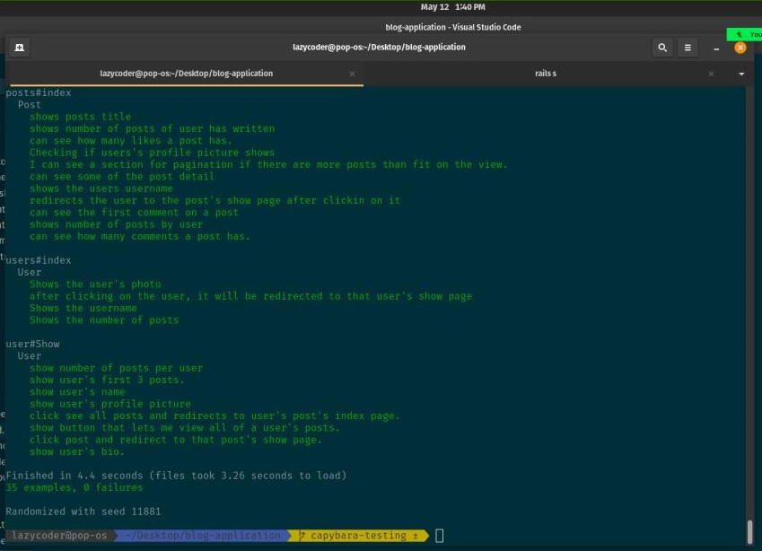

# Blog App

> The blog app is a fully functional website that will show the list of posts and empower readers to interact with them by adding comments and liking posts.

## Project screenshots



Additional description about the project and its features.

## Built With

- RUBY on RAILS
- PostgreSQL

## How to Setup

> You can simply clone or download [this repository](https://github.com/Mithi-code/blog-application), and use your favorite browser or code editor to run this program.

- To open the project after download, simply double click the index.html file

- To open this project using vs code ( for this example) or your favorite code editor, you can follow the guide below:
  > in your cmd or command line navigate to where this project is located, then;

```cmd
cd blog-application
```

> thereafter run

```cmd
code .
```

## How to Run the App through terminal

- To run the application through trminal, make sure ruby and IRB is installed in your computer then follow the guide below:
  > in your cmd or command line navigate to where this project is located, then;

```cmd
cd blog-application
```

## Install Gems

```cmd
bundle install
```

> then initialize the database

```cmd
rails db:reset
```

Incase its the first time:

```cmd
rails db:create
```

then

```cmd
rails db:migrate
```

> thereafter run

```cmd
.rails s
```

## Author

👤 **Mithi**

[@githubhandle](https://github.com/Mithi-code/)
[@twitterhandle](https://twitter.com/sam_mongare)
[LinkedIn](https://www.linkedin.com/in/mithicode/)

## Collabrator

👤 **Atsighi Bright**

- GitHub: [@brytebee](https://github.com/brytebee)
- Twitter: [@brytebee](https://twitter.com/brytebee)
- LinkedIn: [brytebee](https://www.linkedin.com/in/brytebee/)

## 🤝 Contributing

Contributions, issues, and feature requests are welcome!

Feel free to check the [issues page](../../issues/).

## Show your support

Give a ⭐️ if you like this project!

## Acknowledgments

- Microverse Team for facilitating project requirements and resources

## 📝 License

This project is [MIT](./MIT.md) licensed
